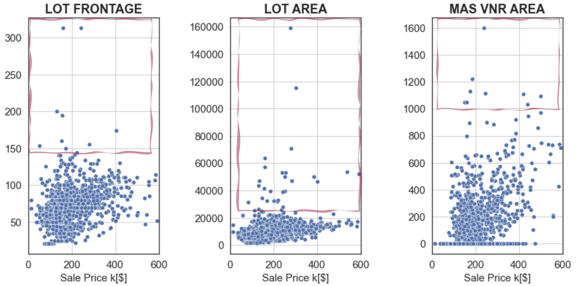
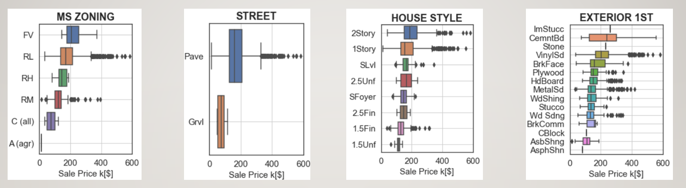
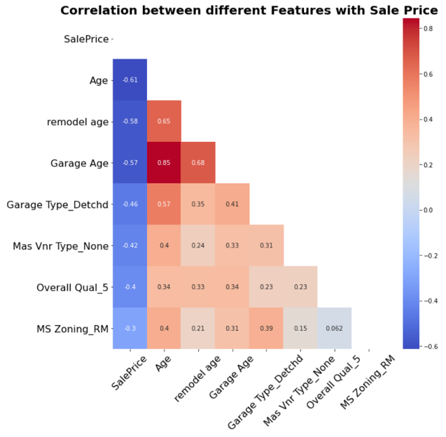
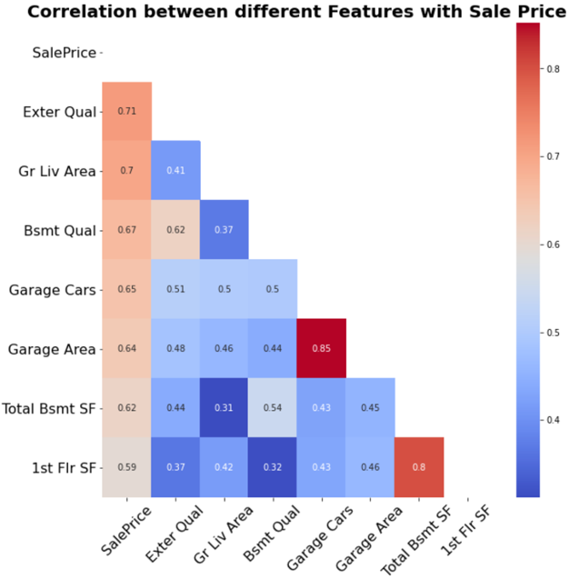
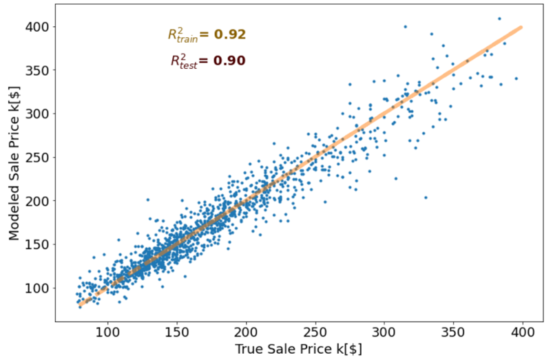
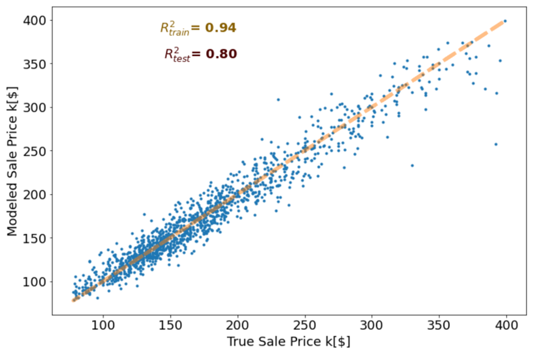
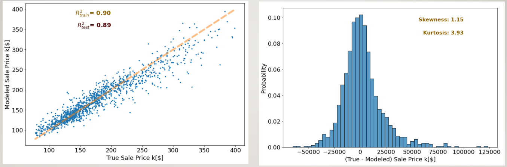
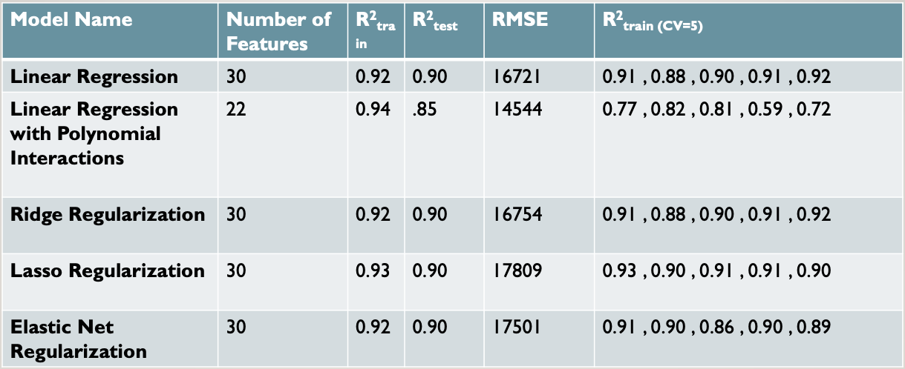

# <b> Housing Sales Price Prediction Using Machine Learning Tools </b>
 creating a rigirious, recursive model for predicting house price using Ames housing database

  
### problem <b>statement</b>
House price is a critical subject for many people no matter if they are homeowners or not. Predicting the sale price is not a trivial subject since several factors are in play! Home features such as age, lot fit, location are among the tens of those that control the price. However, understanding and disentangling these features and their impact on the price is required rigorous statistical modeling. In this project, I used the housing market's detailed information from Ames, Iowa from 2006 to 2010 in order to build a statistical model. more than 50 house features are used in this model. The main objective is to infer the correlation between these features and predict the sale price   

---
---

  
### contents, <b>briefly</b>
---
- readme
    - [File Structure](#fstruc)
    - [Data Dictionary](#ddict)
    - [Data Cleaning](#data_cleaning)
    - [Exploratory Data Analysis](#eda)    
    - [Modeling  Results](#modeling)    
    - [Conclusions and Recommendations](#conclusions)
    - [References](#references)

---
---
### <a id = 'fstruc'>file <b>structure</b></a>

project-2

code  
__ [01_Training_Dataset_Data_Cleaning_Feature_Engineering.ipynb](code/01_Training_Dataset_Data_Cleaning_Feature_Engineering.ipynb) 
__ [02_Test_Dataset_Data_Cleaning_Feature_Engineering.ipynb](code/02_Test_Dataset_Data_Cleaning_Feature_Engineering.ipynb) 
__ [03_Exploratory_Data_Analysis.ipynb](code/03_Exploratory_Data_Analysis.ipynb)   
__ [04_Linear_Regression_Model.ipynb](code/04_Linear_Regression_Model.ipynb)  
__ [05_Linear_Regression_Model_with_Polynomial_Interactions.ipynb](code/05_Linear_Regression_Model_with_Polynomial_Interactions.ipynb) 
__ [06_Rige_Regularization_Model.ipynb](code/06_Rige_Regularization_Model.ipynb)    
__ [07_Lasso_Regularization_Model.ipynb](code/07_Lasso_Regularization_Model.ipynb)  
__ [08_Elastic_Net_Regularization_Model.ipynb](code/08_Elastic_Net_Regularization_Model.ipynb)  

__ data 
__ [test.csv](datasets/test.csv) 
__ [test_df_cleaned.csv](datasets/test_df_cleaned.csv) 
__ [train.csv](datasets/train.csv) 
__ [train_df_cleaned.csv](datasets/train_df_cleaned.csv) 

[presentation.pdf](presentation.pdf) 

[README.md](README.md) 

---
---
  
### <a id = 'ddict'>data <b>dictionary</b></a>
---

|feature name|data type|Definition|
|---|---|---|
|**Identity**|--|--|
|Id|*int*|identification number|
|CLASSIFICATION: STYLE|--|--|
|MS SubClass|*int*|dwelling    type    id|
|	MS  Zoning  	|	*int*	|	  general    zoning    id	|
|	Lot  Frontage  |*float*|  linear    feet    street|
|Lot  Area  |*float*|  lot    size    sft|
|**Property Access**|--|--|
|Street  |*object*|  type    road    access|
|Alley  |*object*|  type    alley    access|
|Lot  Shape  |*object*|  general    shape|
|Land  Contour  |*object*|  flatness|
|Utilities  |*object*|  type    utilities|
|Lot  Config  |*object*|  lot    configuration|
|Land  Slope  |*object*|  slope|
|**Property Location**|--|--|
|Neighborhood  |*object*|  physical    locations|
|Condition  1  |*object*|Proximity to various conditions|
|Condition  2  |*object*|Proximity to various conditions (if more than one is present)|
|**Classification Style**|--|--|
|Bldg  Type  |*object*|  type    dwelling|
|House  Style  |*object*|  style    dwelling|
|**Condition**|--|--|
|Overall  Qual  |*object*|  rates    overall    material|
|Roof  Style  |*object*|  type    roof|
|Roof  Matl  |*object*|  roof    material|
|Exterior  1st  |*object*|  exterior    covering|
|Exterior  2nd  |*object*|  exterior    covering    extra|
|Mas  Vnr  Type  |*object*|  masonry    veneer    type|
|Mas  Vnr  Area  |*object*|  masonry    veneer    area    sft|
|Exter  Qual  |*object*|  evaluates    material    exterior|
|Exter  Cond  |*object*|  evaluates    cond    material    exterior|
|Foundation  |*object*|  type    foundation|
|Bsmt  Qual  |*object*|  evaluates    height    basement|
|Bsmt  Cond  |*object*|  evaluates    general    basement|
|Bsmt  Exposure  |*object*|  walkout    or    garden    level    walls|
|BsmtFin  Type  1  |*object*|  rating    basement    finished    area    1|
|BsmtFin  SF  1  |*float*|  type    1    finished    sft|
|BsmtFin  Type  2  |*object*|  rating    basement    finished    area    2|
|BsmtFin  SF  2  |*float*|  type    2    finished    sft|
|Bsmt  Unf  SF  |*float*|  unfinished    sft    basement    area|
|Total  Bsmt  SF  |*float*|  total    sft    basement    area|
|Heating  |*object*|  type    heating|
|Heating  QC  |*object*|  heating    quality    and    condition|
|Central  Air  |*object*|  central    air    conditioning|
|Electrical  |*object*|  electrical    system|
|1st  Flr  SF  |*float*|  first    floor    sft|
|2nd  Flr  SF  |*float*|  second    floor    sft|
|Low  Qual  Fin  SF  |*object*|  low    quality    finished    sft|
|Gr  Liv  Area  |*object*|  grade    living    area    sft|
|Bsmt  Full  Bath  |*object*|  basement    full    bathrooms|
|Bsmt  Half  Bath  |*object*|  basement    half    bathrooms|
|Full  Bath  |*object*|  full    bathrooms    above    grade|
|Half  Bath  |*object*|  half    baths    above    grade|
|Bedroom  AbvGr  |*object*|  bedrooms    above    grade|
|Kitchen  AbvGr  |*object*|  kitchens    above    grade|
|Kitchen  Qual  |*object*|  kitchen    quality|
|TotRms  AbvGrd  |*object*|  total    rooms    above    grade|
|Functional  |*object*|  home    functionality|
|Fireplaces  |*object*|  number    fireplaces|
|Fireplace  Qu  |*object*|  fireplace    quality|
|Garage  Type  |*object*|  garage    location|
|Garage  Yr  Blt  |*object*|  year    garage    was    built|
|Garage  Finish  |*object*|  interior    finish    garage|
|Garage  Cars  |*object*|  size    garage    in    car    capacity|
|Garage  Area  |*object*|  size    garage    in    sft|
|Garage  Qual  |*object*|  garage    quality|
|Garage  Cond  |*object*|  garage    condition|
|Paved  Drive  |*object*|  paved    driveway|
|Wood  Deck  SF  |*float*|  wood    deck    area    sft|
|Open  Porch  SF  |*float*|  open    porch    area    sft|
|Enclosed  Porch  |*object*|  enclosed    porch    area    sft|
|3Ssn  Porch  |*object*|  three    season    porch    area    sft|
|Screen  Porch  |*object*|  screen    porch    area    sft|
|Pool  Area  |*object*|  pool    area    sft|
|Pool  QC  |*object*|  pool    quality|
|Fence  |*object*|  fence    quality|
|Misc  Feature  |*object*|  miscellaneous    feature|
|Misc  Val  |*object*|  value    miscellaneous    feature|
|**Age/Build year**|--|--|
|Year  Built  |*object*|  original    construction    date|
|Year  Remod/Add  |*object*|  remodel    date|
|Mo  Sold  |*object*|  month    sold|
|Yr  Sold  |*object*|  year    sold|
|**Sale**|--|--|
|Sale  Type  |*object*|  type    sale|
|SalePrice  |*float*|  sale    price|

---
---

---
---
<i>below, a rough outline of the workflow utilized for the duration of this project is illustrated in the following:</i>
  

  

### <a id = 'data_cleaning'>Data,</a> <b>Cleaning</b>
Data pre-processing is an important step in data science that includes identifying the incorrect, incomplete, inaccurate, irrelevant, or missing parts of the data and then modifying, replacing, or deleting them according to the necessity [2]. The Ames dataset consists of two training and test dataset. All features of these datasets are categorized as follow:
Features with continuous numeric values: such as 'Lot Frontage'

  

  

2. Categorical features with string objects: such as 'Lot Shape', 'Neighborhood'
  

  

3. Categorical features with numeric values: such as 'Overall Qual'

4. Quality features with string objects in a range of poor to Excellent

5. Features with potential for engineering: such as 'Year Build' and 'Yr Sold' which were employed to calculate a new feature 'Age'. 

In the next step, null values in each feature column were identified, and then they were replaced with the column mean, mode, and NA (e.g, Not Available) values. All features were plotted as well using matplitlib and seaborn packages in order to find outliers. Those outliers were then removed from the training data.  

### <a id = 'eda'> <b>Exploratory Data Analysis</b>
---
The processed training data were group into two categories based on their Pearson correlation coefficient with the target feature (i.e., `Sale Price`) as follows:
    
1. Features with the lowest correlation with SalePrice
    
  

  

2. Features with the highest correlation with SalePrice
  

  

Some of these features were utilized in modeling in order to infer and predict the `SalePrice` feature. 

---
---
### <a id = 'modeling'>Modeling  Results</b>
Features with the most positive/negative correlation were used to construct different models using the following approaches:

1. Linear Regression:
  

  

2. Linear Regression with Polynomial Features:
  

  

3. Ridge regeneralization model:
  

  

4. Lasso regeneralization model:
  

  

5. Elastic Net Model:
  

  

### <a id = 'conclusions'>conclusions</a> </b>
---

The following table depicts the strength of each modeling method in inferring the sale prices. Linear regression and generalization models (e.g., Ridge, Lasso) in general require a large number of features. In contrast, the Linear Regression modeling approach with polynomial interaction features could have the same prediction power but with fewer features. Implementing these regression methods, above 90% of the Ames housing sale price is predicted.  

  

  

---
---

  
### references
---
[1] [Dean De Cock "Ames, Iowa: Alternative to the Boston Housing Data as an End of Semester Regression Project", Journal of Statistics Education, Volume 19, Number 3(2011)](http://jse.amstat.org/v19n3/decock.pdf)  
[2] What is Data Cleaning? How to Process Data for Analytics and Machine Learning Modeling? (https://towardsdatascience.com/what-is-data-cleaning-how-to-process-data-for-analytics-and-machine-learning-modeling-c2afcf4fbf45)  

---
---

